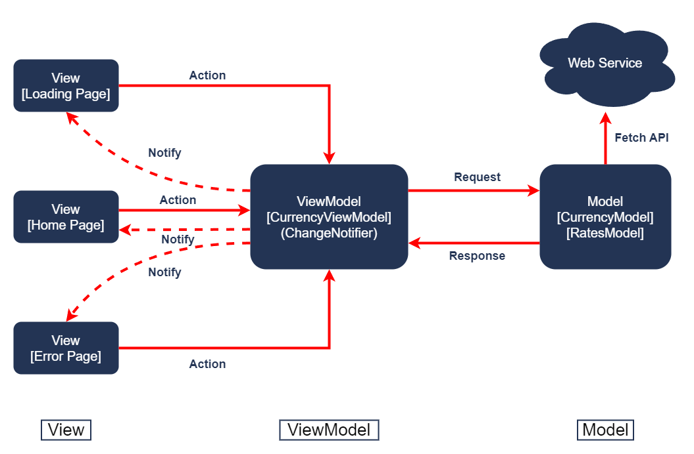

# Currency Converter Flutter App

## Overview
This app is a simple and efficient currency converter built with Flutter, allowing users to convert between various currencies in real-time. The app fetches latest exchange rates from an API and provides a user-friendly interface for seamless conversion.

## Features
- List of available currencies.
- Base and target currency selection.
- Fetch live exchange rates data from API.
- Display converted amount in real-time.
- User-friendly minimal interface.

## Architecture
This app follows the **Model-View-ViewModel (MVVM)** pattern. Here's an overview of each component:
- **View**: Displays UI elements and interacts with users, updating based on changes in the **ViewModel**.
- **ViewModel**: Acts as a mediator between **View** and **Model**. Manages app state and handles data logic. 
- **Model**: Responsible for data operations, fetching currency rates from the API and providing data to the **ViewModel**.


## Folder Structure
```
lib/
├── models/                             # Holds main app data models.
│   ├── currency_model.dart
│   └── rates_model.dart
├── pages/                              # Contains UI screens.
│   ├── converter_page.dart
│   ├── error_page.dart
│   ├── home_page.dart
│   └── loading_page.dart
├── repositories/                       # Manage data retrieval from API and provides data to ViewModel layer.
│   ├── currency_repository.dart
│   └── rates_repository.dart
├── services/                           # Includes API integration for fetching live data.
│   └── api_client.dart
├── utils/                              # Contains helper utilities, such as for API response. 
│   ├── api_response.dart
│   └── app_constants.dart
├── viewmodels/                         # Manage the app's state and business logic for specific views.
│   └── currency_view_model.dart
├── widgets/                            # Holds reusable components.
│   └── custom_drop_down.dart
└── main.dart
```

## Getting Started
Follow these steps to get the app up and running:
1. Clone the repository: ```git clone https://github.com/trungdai01/currency_converter.git```
2. Navigate to the project directory: ```cd currency_converter```
3. Install dependencies: ```flutter pub get```
4. Run the app: ```flutter run```

## API Integration
The app integrates a free currency exchange rates API from this repository [exchange-api](https://github.com/fawazahmed0/exchange-api).

## Dependencies
- [http](https://pub.dev/packages/http): For making HTTP requests.
- [provider](https://pub.dev/packages/provider): State management package.
- [dropdown_button2](https://pub.dev/packages/dropdown_button2): Steady dropdown menu.
- [intl](https://pub.dev/packages/intl): For number formatting.
- [mockito](https://pub.dev/packages/mockito): Unit testing package.
- [build_runner](https://pub.dev/packages/build_runner): Generating file package.
  
## Usage
Valid values are **numbers 0-9**, **comma** and **decimal point**. If the value has more than one decimal point, that one is invalid and the app will indicate an error. If the value has a comma, the user must input exactly three digits after that comma to get the value accepted. Otherwise, it will be rejected.

Examples of valid input:
- 123
- 1,000
- 123,123,123.456
- 0.95

Examples of invalid input:
- 1.2.3
- 1,23
- 1,2,3
- 1.23,4
- 007
- .95

## Video demonstration
Check out this [link](https://drive.google.com/file/d/1v9IQ5KgimmegiI7fs1wfXJY7Ww3J_dRJ/view?usp=drive_link). 